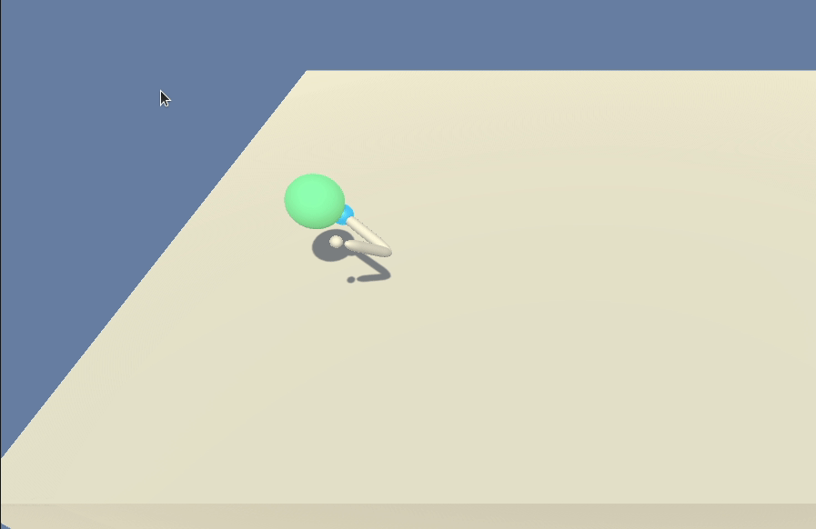
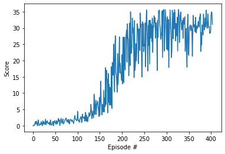

## Project2: Continuous Control Reacher

### The Goal of this project:
Is to train an agent that is a double-jointed arm and can move to target locations in an environment. A reward of +0.1 is provided for each step the agent's hand is in the goal location. 
Please refer to the README.md for environment details and download links.

### Definition of Solved:
The environment is solved if the agent can accumulate an average score of >=+30 over 100 consecutive episodes.

### Method used:
To solve this challenge, I trained and used a Deep Deterministic Policy Gradient  ([DDPG](https://arxiv.org/pdf/1509.02971.pdf)) agent

DDPG uses an actor network to directly esitmate the policy for the agent and a critic to estimate state action values to overcome the actor's high variance.

`Description of the algorithm, Taken from “Continuous Control With Deep Reinforcement Learning” (Lillicrap et al, 2015)` 

### Networks architecture:
- Actor(
  - (fc0): Linear(in_features=33, out_features=128, bias=True)
  - Followed by a leaky relu activation
  - (bn0): BatchNorm1d(128, eps=1e-05, momentum=0.1, affine=True, track_running_stats=True)
  - (fc1): Linear(in_features=128, out_features=128, bias=True)
  - Followed by a leaky relu activation
  - (bn1): BatchNorm1d(128, eps=1e-05, momentum=0.1, affine=True, track_running_stats=True)
  - (fc2): Linear(in_features=128, out_features=4, bias=True)
  - Followed by a tanh activation for the four output actions each of value between -1 and 1
)

The idea behind the applied batch normalization for the actor is to keep the network values small and not abruptly dimish them with just the tanh at the output.

- Critic(
  - (fcs1): Linear(in_features=33, out_features=256, bias=True) this layer takes the state as input
  - Followed by a leaky relu activation
  - (fc2): Linear(in_features=260, out_features=128, bias=True) this layer is a concatination of the previous layer and the actions
  - Followed by a leaky relu activation
  - (fc3): Linear(in_features=128, out_features=1, bias=True)
)

and of course, the target actor and target critic are the same as these.

### Project files:
- `model.py` contains the Actor and the Critic network implementations, following closely udacity's implementation for [ddpg-bipedal](https://github.com/udacity/deep-reinforcement-learning/tree/master/ddpg-bipedal) with a few modifications

- `ddpg_agent.py` the ddpg agent, also following closely udacity's implementation in the mentioned link with a few modifications

- `ContinuousControl-Reacher.ipynb` the notebook driving the training process
- `trained_actor.pth` a trained actor
- `trained_critic.pth` a trained critic
- `play_trained_agent.ipynb` a notebook to play the environment used the trained actor and critic

### Hyperparameters used:
similar to the udacity's implementation for [ddpg-bipedal](https://github.com/udacity/deep-reinforcement-learning/tree/master/ddpg-bipedal) with a few modifications

- `BUFFER_SIZE = int(1e5)`    # replay buffer size
- `BATCH_SIZE = 512`          # minibatch size
- `GAMMA = 0.99`              # discount factor
- `TAU = 1e-4`              # for soft update of target parameters
- `LR_ACTOR = 1e-3`         # learning rate of the actor
- `LR_CRITIC = 3e-4`        # learning rate of the critic
- `WEIGHT_DECAY = 0.0000`   # L2 weight decay, not used
- `ACTOR_HIDDEN = 128`		# number of neurons in the actor's hidden layers
- `CRITIC_HIDDEN1 = 256`  # number of neurons in the critic's first hidden layer
- `CRITIC_HIDDEN2 = 128`  # number of neurons in the critic's second hidden layer

and a seed of 13 for reproducibility

### Training results:
 - Episode 100	Average Score: 1.11
 - Episode 200	Average Score: 8.29
 - Episode 300	Average Score: 27.10
 - Episode 400	Average Score: 29.78
 - Episode 404	Average Score: 30.03

Environment solved in 304 episodes!	Average Score: 30.03

### Future work:

Beside exploring other fancy algoriths from the Deep Reinforcement Learning toolbox like A3C and D4PG and trying them on the parallel agents version of the environment, I have one unique idea in mind, that is tailoring the reward signal better.

As mentioned in the literature, the reward signal is a critical part for a good stable agent learning and a very sparse reward at the early beginning as in the current environment implementation e.g. +0.1 for being in the goal and 0 otherwise can significantly slow down the training of the agent and it can get stuck thinking there is no way out.

My idea would be to edit the reward signal a bit to reflect proximity of the Agent's handle's center from the goal center and I would like to decay such reward to 0 each step in the training so that the agent eventually learns to target the goal precisely and not only close to it.